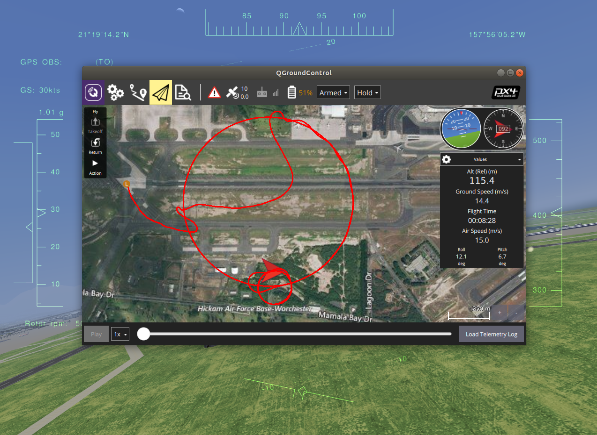

# FlightGear Bridge

The FlightGear alternative to the current PX4's mainstream simulator Gazebo.



This stand-alone application adding the possibility of the use of the FlightGear simulator. The system was tested on the [Rascal airplane](https://github.com/ThunderFly-aerospace/FlightGear-Rascal) and [TF-G1](https://github.com/ThunderFly-aerospace/FlightGear-TF-G1) autogyro simulation models.

It connects to FG (over UDP generic protocol) and transforms the data to TCP MAVlink packets for the PX4 stack.

### How to run the development version:

#### Install:
1) Install FlightGear. In Ubuntu You can use install last stable FG from PAA repository by folowing commands: ```sudo add-apt-repository -y -u ppa:saiarcot895/flightgear``` and ```sudo DEBIAN_FRONTEND=noninteractive apt-get -y --quiet install flightgear```
2) Set write permissions to the `Protocols` folder of the FlightGear Data. On Ubuntu run ```sudo chmod a+w /usr/share/games/flightgear/Protocols```
#### Run:
1) Open [QgroundControl](http://qgroundcontrol.com/)
2) In PX4Firmware folder run: ```make px4_sitl_nolockstep flightgear_rascal``` for plane.
3) Wait until FlightGear fully loads.
#### Known issue:
1) If you have FPS lower than 20 it will not work correctly. Check your FPS. In FlightGear bridge look set View->View Options->Show frame rate
2) You can use wild set of FG version - we tested instalation with FG 2019.1.1 and Nextgen FG (nightly builds). But in past I shorly tested basic functionality on Debian 9, FG 2016.1.1 from distribution repository, with some Racal (JSBSim) model.
3) Default models used by bridge is placed in bridge models subdirectory (as git submodules). Multiple models in this directory need up-to-date FlightGear from nightly budils (e.g.: these with eletric engine).
4) If you set-up mission take off to oposite direction than aircraft current heading, than the aircraft will fly directly forever. (maybe in other scenarios too). Nobody knows why.
5) Internally starting scripts run ```fgfs``` with set of parameters to reduce graphic, connect FG to bridge and use model from subdirectory. But before that, the starting script search for FG-Data folder by running ```fgfs --version```. If your output of this command does not contains FG_ROOT line, the startup script and whole bridge will not work. Check how your system runs FG by commnad ```which fgfs```. Advanced Options of bridge may help.
6) If you want more friendly plane, you can switch Rascal model from YASim physical engine to JSBSim physical engine by editing file ```models/rascal.json```. Substitue ```Rascal110-YASim``` by ```Rascal110-JSBSim```.

### Advanced Options

You can tune your FG installation/settings by the following environment variables:

1) FG\_BINARY - absolute path to FG binary to run. (It can be an AppImage)
2) FG\_MODELS\_DIR - absolute path to the folder containing the manually-downloaded aircraft models which should be used for simulation.
3) FG\_ARGS\_EX - any additional FG parameters

FlightGear Bridge and starting script now support multiple instances of PX4. FG\_run script takes the second argument, which is PX4 ID (and automatically adjust the port numbers according to given number) and bridge binary takes this ID as the first argument before the output of get\_FGbridge\_params.py

### Limitations

The PX4 is connected to FlightGear thought "[generic protocol](http://wiki.flightgear.org/Generic_protocol)", which is served synchronously to the simulator graphics engine frame rate. So the PX4 gets the sensor data in frequency, depending on graphics resources and the current scene. The source-code implements artificial upsampling of sensor data to ~100Hz in the order to avoid stale sensor detection. Random noise is added to the sensor data.

The possible better approach is to obtain the FlightGear using an [HLA](http://wiki.flightgear.org/High-Level_Architecture) interface.

### Credits

 FlightGear bridge was initially developed at [ThunderFly s.r.o.](https://www.thunderfly.cz/) by Vít Hanousek <info@thunderfly.cz>
